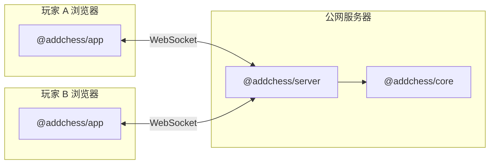

# 前端 / 后端 / 共享逻辑 分工

本文说明 AddChess  monorepo 里**谁算前端、谁算后端、谁两边共用**，以及联机时数据怎么流。

---

## 1. 三层一览

| 包 | npm 名 | 层级 | 运行位置 | 当前状态 |
|----|--------|------|----------|----------|
| **`packages/app`** | `@addchess/app` | **前端** | 用户**浏览器** | ✅ 已实现（React + Vite） |
| **`packages/server`** | `@addchess/server` | **后端** | **云服务器 / 本机 Node** | ✅ 已实现（WebSocket 房间 + 校验） |
| **`packages/core`** | `@addchess/core` | **共享规则引擎** | 浏览器 **或** Node | ✅ 已实现（无 UI、无网络） |

**重要**：`@addchess/core` **既不是前端也不是后端**，而是**两边都要用的棋规库**。  
- 现在：只被 **前端** 打包进页面，在浏览器里算着法。  
- 联机后：**服务器**也会 import 同一套 core，用来校验对手发来的着法并更新权威局面。

---

## 2. 代码分层（概览）

```
addchess/
├── packages/app/      # 前端（React + Vite）
├── packages/server/   # 联机后端（WebSocket + 房间）
└── packages/core/     # 共享规则引擎
```

本地开发：`npm run dev` + 可选 `npm run dev:server`。  
线上：`https://addchess.cn` + `wss://ws.addchess.cn`（见 [DEPLOY-SERVER-CN.md](./DEPLOY-SERVER-CN.md)）。

---

## 3. 联机架构（已实现）



| 步骤 | 谁做 |
|------|------|
| 创建 / 加入房间（房间号） | **server** 生成 roomId，维护连接列表 |
| 点开始 | **server** 用 `createVariantInitial()` 等初始化，广播 snapshot |
| 点格子 / 加子 | **app** 发 `{ type: 'move', ... }` → **server** 用 core `apply*` 校验 → 广播新 snapshot |
| 渲染棋盘 | **app** 只根据收到的 snapshot 显示（不再单方面改权威局面） |

联机前端通过构建时环境变量 `VITE_WS_URL`（生产为 `wss://ws.addchess.cn`）连接后端。

---

## 4. 部署时分家

| 产物 | 部署到哪 | 命令示例 |
|------|----------|----------|
| `packages/app/dist/` | **Nginx 静态目录**（`https://addchess.cn`） | `bash scripts/deploy-all.sh` |
| `packages/server` 编译结果 | 同机 pm2 + `wss://ws.addchess.cn` | 同上 |

- **前端**：静态文件，**不能**单独实现 WebSocket 房间。  
- **后端**：必须 **24/7 在线**（或至少对局期间在线），别人才能用房间号联机。

---

## 5. 常用命令（分拆后）

| 命令 | 作用 |
|------|------|
| `npm run dev` | 仅 **前端** 开发（Vite，`localhost:5173`） |
| `npm run dev:server` | **后端** 开发（Node，`localhost:3000`） |
| `npm test` | 测 **core**（规则引擎） |
| `npm run build` | 构建 **前端** 静态站 |
| `npm run build:core` | 构建 **core**（server 引用 dist 前需要） |

更细的目录树见 [STRUCTURE.md](./STRUCTURE.md)。
