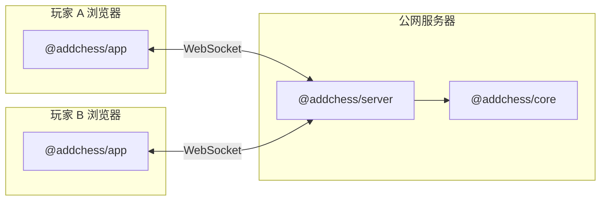

# 前端 / 后端 / 共享逻辑 分工

本文说明 AddChess  monorepo 里**谁算前端、谁算后端、谁两边共用**，以及联机时数据怎么流。

---

## 1. 三层一览

| 包 | npm 名 | 层级 | 运行位置 | 当前状态 |
|----|--------|------|----------|----------|
| **`packages/app`** | `@addchess/app` | **前端** | 用户**浏览器** | ✅ 已实现（React + Vite） |
| **`packages/server`** | `@addchess/server` | **后端** | **云服务器 / 本机 Node** | 🚧 骨架已建，联机逻辑待实现 |
| **`packages/core`** | `@addchess/core` | **共享规则引擎** | 浏览器 **或** Node | ✅ 已实现（无 UI、无网络） |

**重要**：`@addchess/core` **既不是前端也不是后端**，而是**两边都要用的棋规库**。  
- 现在：只被 **前端** 打包进页面，在浏览器里算着法。  
- 联机后：**服务器**也会 import 同一套 core，用来校验对手发来的着法并更新权威局面。

---

## 2. 现在整仓代码属于哪一层？

### 全是「前端 + 共享逻辑」，还没有可联机的后端业务

```
addchess/
├── docs/                    # 文档（不属于运行时）
├── package.json             # 根：workspaces 聚合脚本
│
├── packages/app/            # ★ 前端 — 全部在用户浏览器执行
│   └── src/
│       ├── main.tsx, App.tsx
│       ├── components/      # 棋盘、按钮、规则展示
│       ├── hooks/           # useVariantGame：本地 state、悔棋
│       └── styles/
│
├── packages/core/             # ★ 共享 — 无 DOM、无 React、无 WebSocket
│   └── src/
│       ├── model/           # 棋盘、棋子类型
│       ├── chess/           # 标准国际象棋
│       └── variant/         # 加子棋规则
│
└── packages/server/           # ★ 后端 — 仅占位，尚未处理对局
    └── src/                 # 将来：房间号、WebSocket、广播局面
```

### 逐项对照

| 路径 | 前端 / 后端 / 共享 | 说明 |
|------|-------------------|------|
| `packages/app/**` | **前端** | 页面、交互、样式；`npm run dev` 起的是 Vite，只服务浏览器 |
| `packages/core/**` | **共享** | 规则与 `VariantSnapshot`；可被 app 与 server 引用 |
| `packages/server/**` | **后端** | 常驻 Node 进程；对外提供 WebSocket（规划） |
| `docs/**`, `README.md` | 无 | 文档 |
| 根 `package.json` | 无 | 脚本入口，不是业务代码 |

**结论**：你目前能玩的「本地加子棋」= **`app`（前端壳） + `core`（在浏览器里当引擎）**。  
**没有**任何代码在公网上替两人转发着法；`localhost:5173` 只是本机开发服务器，不是联机后端。

---

## 3. 联机目标架构（参考 room 号站点）



| 步骤 | 谁做 |
|------|------|
| 创建 / 加入房间（房间号） | **server** 生成 roomId，维护连接列表 |
| 点开始 | **server** 用 `createVariantInitial()` 等初始化，广播 snapshot |
| 点格子 / 加子 | **app** 发 `{ type: 'move', ... }` → **server** 用 core `apply*` 校验 → 广播新 snapshot |
| 渲染棋盘 | **app** 只根据收到的 snapshot 显示（不再单方面改权威局面） |

前端将来会多：

- 房间页（输入房间号 / 创建房间）
- `useMultiplayerGame` 或扩展 `useVariantGame`：连 `ws://` / `wss://`
- 环境变量：`VITE_WS_URL`（开发 `localhost:3000`，生产 `wss://你的域名`）

后端将来会多（在 `packages/server/src/`）：

| 文件（规划） | 职责 |
|--------------|------|
| `index.ts` | 启动 HTTP + WebSocket |
| `rooms.ts` | 房间号 → 两名玩家 socket + 局面 |
| `protocol.ts` | 前后端 JSON 消息类型 |
| `wire.ts` 或放在 core | `VariantSnapshot` ↔ JSON（Map 序列化） |

---

## 4. 部署时分家

| 产物 | 部署到哪 | 命令示例 |
|------|----------|----------|
| `packages/app/dist/` | GitHub Pages / Vercel / Nginx 静态目录 | `npm run build` |
| `packages/server` 编译结果 | Railway / **国内 VPS** / 云主机 Node 进程 | 见 [docs/DEPLOY-SERVER-CN.md](./docs/DEPLOY-SERVER-CN.md) |

- **前端**：静态文件，**不能**单独实现 WebSocket 房间。  
- **后端**：必须 **24/7 在线**（或至少对局期间在线），别人才能用房间号联机。

---

## 5. 常用命令（分拆后）

| 命令 | 作用 |
|------|------|
| `npm run dev` | 仅 **前端** 开发（Vite，`localhost:5173`） |
| `npm run dev:server` | **后端** 开发（Node，`localhost:3000`，当前为健康检查占位） |
| `npm test` | 测 **core**（规则引擎） |
| `npm run build` | 构建 **前端** 静态站 |
| `npm run build:core` | 构建 **core**（server 引用 dist 前需要） |

更细的目录树见 [STRUCTURE.md](./STRUCTURE.md)。
